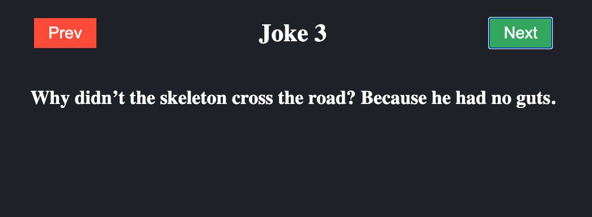

# MyOwnReact
## Motivation

- For light weight lib like react for vanilla js project
- To confirm the react lifecycle

## Topics

- set up project with `webpack` and `babel`
- jsx transforming with `babel` plugin
- config `prettier` and `eslint`
- built `react-like lib` from scratch
- support `useState`, `useEffect`, `function component`
- `webpack dev server`

## How to use this library

1. Download or clone this repo 
```
https://github.com/FrozenIce0617/my-own-react-lib 
```

2. Install dependencies

```
yarn or yarn install
```

Now, you can use `MyOwnReact` as like `react` in `.src/index.js` file.

```
// import library
import MyOwnReact from '../lib/MyOwnReact'
import App from './App'

MyOwnReact.render(<App />, document.getElementById('root'))
```
we can create App in ./App.js file like react component

```
import MyOwnReact from '../lib/MyOwnReact'
const App = () => {
    return <h1>Hello world </h1>
}

export default App
```

you can run `npx webpack serve` as dev server, then you can see the app is running at `localhost:9000` on browser.


## demo app
The demo app shows the dad joke and possible to see next or prev joke by clicking buttons.
It is implemented `useEffect`, `useState` of this lib.


<p align="center">
    
</p>

```
import MyOwnReact from '../lib/MyOwnReact'
require('./style.css')

const DAD_JOKE_BASE_URL = 'https://icanhazdadjoke.com'
const MAX_INDEX = 10

const App = () => {
  const [index, setIndex] = MyOwnReact.useState(0)
  const [jokes, setJokes] = MyOwnReact.useState([])

  const handleEvent = (isNext = true) => {
    const nextIndex = isNext ? index + 1 : index - 1
    setIndex((nextIndex + MAX_INDEX) % MAX_INDEX)
  }

  MyOwnReact.useEffect(() => {
    // fetching joke list using api at first loading...
    fetch(`${DAD_JOKE_BASE_URL}/search`, {
      headers: {
        accept: 'application/json',
      },
    })
      .then((response) => response.json())
      .then((jsonData) => {
        setJokes(jsonData.results)
      })
  }, [])

  return (
    <div className="App">
      <div className="content">
        <div className="controls">
          <button onClick={() => handleEvent(false)} className="btn btn-prev">
            Prev
          </button>
          <h2>Joke {index + 1}</h2>
          <button onClick={() => handleEvent()} className="btn btn-next">
            Next
          </button>
        </div>
        <h3 className="joke">{jokes[index]?.joke}</h3>
      </div>
    </div>
  )
}

export default App

```